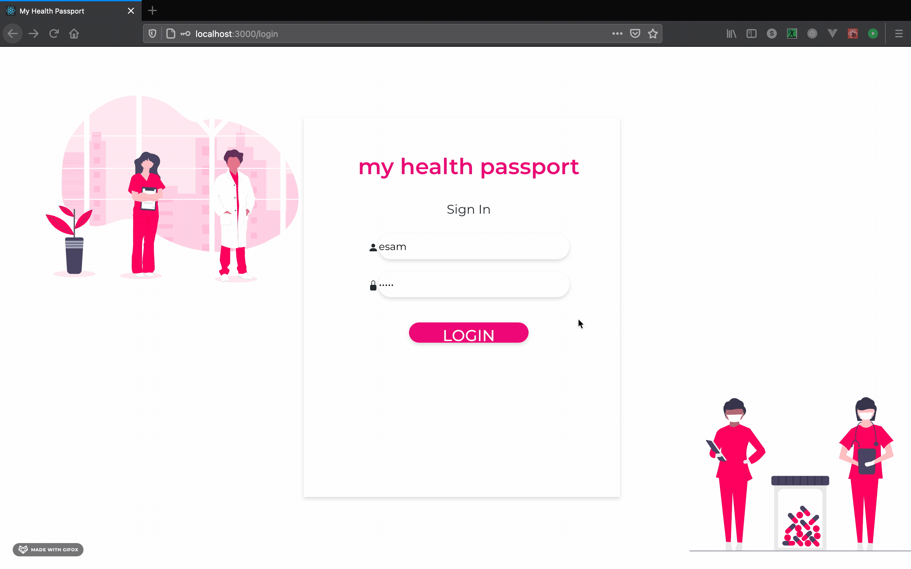

# my health passport

## Setup Instructions

To start the server, navigate into the main project directory and run:
- `yarn install`
- `yarn migrate`
- `yarn start`

To start the User interface, navigate into the client directory and run:
- `yarn install`
- `yarn start`

## DOCUMENTATION
- [Flow Diagram](https://drive.google.com/file/d/1vxE3Ix51_bbo4uyxbAhnPRLrUW3QqObU/view?usp=sharing)
- [Database Schema](https://drive.google.com/file/d/1iIEjmYoraTFh7noHwjWdVVqihlVDnAF5/view?usp=sharing)
- [API](https://docs.google.com/document/d/1TAR7NmHNvCRbL2y6NMRQdfZzJRzd2jRlOHNXrtsaMgM/edit?usp=sharing)

_This is a student project that was created at [CodeOp](http://codeop.tech), a full stack development bootcamp in Barcelona._